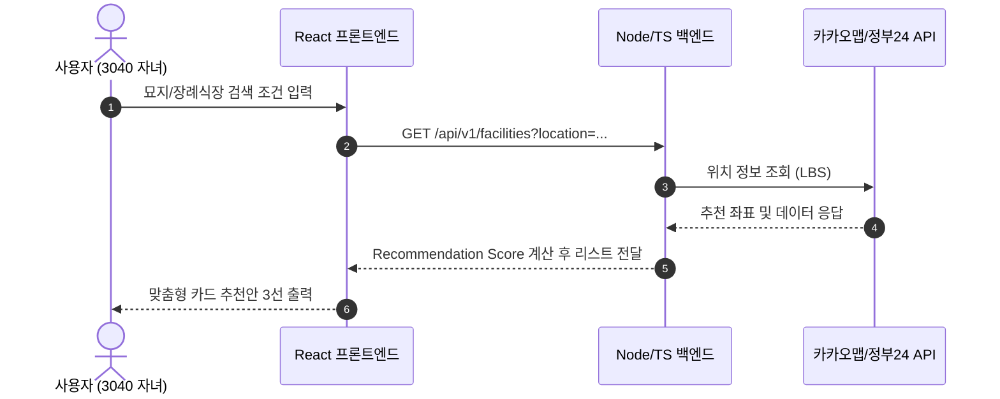

# 📊 다이어그램 및 인포그래픽 시각화 스펙 가이드

> **적용 대상:** 시스템 아키텍처, 서비스 흐름도, 시퀀스 다이어그램, 데이터 모델링(ERD), 인포그래픽

---

## 1. Mermaid.js 다이어그램 표준 수칙

문서 내 복잡한 가공 흐름은 텍스트가 아닌 `Mermaid.js` 코드를 활용하여 동적으로 시각화한다.

### Mermaid 작성 문법 준수사항
1. **노드 텍스트 괄호 예외 처리**: 노드 라벨에 특수문자나 괄호가 들어갈 경우 반드시 쌍따옴표로 감싼다.
   * `ID["노드 라벨 (부가 설명)"]` (O)
   * `ID[노드 라벨 (부가 설명)]` (X - 렌더링 에러 유발)
2. **HTML 태그 금지**: 라벨 내 직접 HTML 태그(`<b>`, `<br/>` 외 특수태그) 금지.
3. **클래스 기반 스타일링 (classDef)**:
   ```mermaid
   graph TD
       classDef primary fill:#1A2B4C,stroke:#1A2B4C,color:#FFFFFF;
       classDef point fill:#4E7055,stroke:#4E7055,color:#FFFFFF;
       classDef light fill:#F7F4EF,stroke:#DFDCD7,color:#2F3E46;

       A["1단계: 생전 웰다잉 준비"]:::point --> B("엔딩노트 작성"):::light
       B --> C["2단계: 서비스 매칭"]:::primary
   ```

---

## 2. 주요 다이어그램 유형별 스펙

### 1) 프로세스 플로우 (Flowchart)
* **방향**: `graph TD` (위에서 아래로) 또는 `graph LR` (좌에서 우로)
* **단계별 색상**: 1단계(그리너리 `#4E7055`), 2단계(딥 네이비 `#1A2B4C`), 외부 시스템(베이지 `#EAE5DC`)

### 2) 시퀀스 다이어그램 (Sequence Diagram)
* 사용자-프론트엔드-백엔드-외부 API 연동 간 메시지 주고받음을 시각화


---

## 3. 인포그래픽 카드 (Infographic Card) 구현

텍스트 데이터를 보기 쉽게 박스화할 때 CSS 인포그래픽 서식을 사용한다:

```html
<div class="grid">
    <div class="card" style="border-left: 5px solid var(--primary-color);">
        <div class="card-title">💡 정보 불균형 해소</div>
        <div class="card-content">폐쇄적인 시장 정보를 투명하게 표준화</div>
    </div>
</div>
```
* **아이콘**: 이모지(Emoji) 또는 SVG 아이콘을 타이틀 좌측에 반드시 부착하여 직관성 보장.
