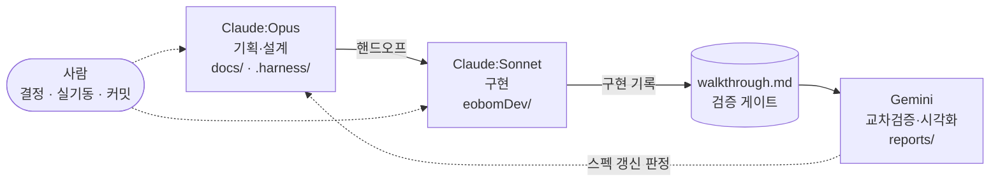

<div align="center">

# 🌿 이어봄 (Eobom)

**디지털 엔딩 & 웰다잉 토탈 케어 플랫폼**
생전 준비부터 임종·사후 정리까지

[](https://github.com/Hyunews/Eobom/actions/workflows/backend-test.yml)


[서비스](https://eobom.vercel.app) · [코드 실행](eobomDev/README.md) · [기획 목차](docs/00_DOCS_INDEX.md) · [에이전트 규칙](.harness/AGENTS.md)

</div>

---

이 저장소에는 **소스코드 · 기획 정본(SSOT) · AI 에이전트 하네스**가 함께 들어 있습니다.

## 🧭 어디부터 보나

| 목적 | 여기로 |
| :--- | :--- |
| **지금 뭘 해야 하나** | [`.harness/memory/context.md`](.harness/memory/context.md) |
| **코드를 돌려보고 싶다** | [`eobomDev/README.md`](eobomDev/README.md) — ⚠️ **`https://` 필수 · DB 포트 5433** |
| **기획을 읽고 싶다** | [`docs/00_DOCS_INDEX.md`](docs/00_DOCS_INDEX.md) |
| **외부 연동이 왜 안 되나** | [`.harness/systems.md`](.harness/systems.md) — OAuth·지도·DB·저장소·배포 명부 |
| **DB를 건드려야 한다** | [`.harness/db-safety.md`](.harness/db-safety.md) — 🔴 쓰기 전 백업 |
| **AI 에이전트로 작업한다** | [`.harness/AGENTS.md`](.harness/AGENTS.md) ← **행동 규칙 정본** |

## 🌐 배포

| 구분 | 위치 | 비고 |
| :--- | :--- | :--- |
| 프론트엔드 | [eobom.vercel.app](https://eobom.vercel.app) | Vercel |
| 백엔드 | `eobom-backend.onrender.com` | Render — 설정은 [`render.yaml`](render.yaml) |
| DB | Supabase (서울) | 운영 스키마 변경은 `.harness/tools/migrate-prod.ps1` |
| CI | GitHub Actions | 백엔드 시험 — [`backend-test.yml`](.github/workflows/backend-test.yml) |

## 🏗️ 도메인

번호는 **사용자 여정 순서**입니다(메뉴 순서와 1:1로 맞지 않습니다).
방문자는 **WellDying(생전 준비)** 과 **유가족(사후)** 두 방향으로 나뉩니다.

| # | 도메인 | 화면 | 기획 |
| :---: | :--- | :--- | :--- |
| 00 | 핵심 플랫폼 (회원·보존·개인정보·인프라) | — | [`docs/00_핵심플랫폼`](docs/00_핵심플랫폼) |
| 01 | 장사시설 매칭 | `facility` | [`docs/01_장사시설_매칭`](docs/01_장사시설_매칭) |
| 02 | 전문가 매칭 (상속·법률) | `counseling` | [`docs/02_전문가_매칭`](docs/02_전문가_매칭) |
| 03 | 현물 유품 수거 | `pickup` | [`docs/03_현물_유품_수거`](docs/03_현물_유품_수거) |
| 04 | 디지털 자산 · 계정 정산 | `digital-estate` | [`docs/04_디지털_자산_정산`](docs/04_디지털_자산_정산) |
| 05 | 디지털 추모관 | `memorial` | [`docs/05_디지털_추모관`](docs/05_디지털_추모관) |
| 06 | 디지털 엔딩노트 · 유언 | `ending-note` | [`docs/06_엔딩노트_유언`](docs/06_엔딩노트_유언) |
| 07 | 상중 · 행정 케어 | `care-guide` · `obituary` | [`docs/07_상중_행정_케어`](docs/07_상중_행정_케어) |
| 08 | 비즈니스 분석 | — | [`docs/08_비즈니스_분석`](docs/08_비즈니스_분석) |

## 📁 저장소 구조

```text
Eobom/
├── eobomDev/          💻 소스코드
│   ├── frontend/        React 18 + Vite 5 + TypeScript
│   ├── backend/         Express + Prisma + JWT (스키마·마이그레이션은 여기에만)
│   └── workers/         Cloudflare Worker (R2 아카이브 중계)
├── docs/              📄 기획 정본 (Markdown) + 작업일지_및_기록/ · 트러블슈팅/
├── .harness/          🤖 에이전트 규칙 · 메모리 · 도구
├── .github/workflows/ ⚙️ CI (백엔드 시험)
├── assets/            📁 원천 데이터 (복지부 CSV · 로고)
├── reports/           📊 사람 열람용 HTML·PDF — 🔴 git 제외(로컬 전용)
├── backups/           🗄️ DB 백업 — 🔴 git 제외
└── render.yaml        백엔드 배포 Blueprint
```

> ⚠️ **Prisma 명령은 `eobomDev/backend/`에서만** 실행합니다. 저장소 루트에는 `prisma/`가 없습니다.

## 🤝 작업 방식 — 1인 + 3주체 분업

혼자 개발하면서 역할을 셋으로 나눕니다. 각 주체는 자기 폴더에만 씁니다 — 소유권이 섞이면 문서와 코드가 어긋납니다.



| 주체 | 쓰는 곳 | 하는 일 | 🔴 하지 않는 것 |
| :--- | :--- | :--- | :--- |
| **Claude:Opus** | `docs/` · `.harness/` | 기획·설계·스펙 확정 → 핸드오프 | 코드 작성 |
| **Claude:Sonnet** | `eobomDev/` | 확정 스펙대로 구현 + 시험 | `docs/` 수정 (편차는 walkthrough로) |
| **Gemini** | `reports/` | 교차검증 · 시각화 | `docs/` 수정 |
| **사람** | — | 결정 · 실기동 확인 · **커밋** · 운영 반영 | — |

- 검증 게이트는 [`walkthrough.md`](docs/작업일지_및_기록/에이전트_기록/walkthrough.md) **한 곳**입니다.
- 상세 규칙은 [`.harness/roles.md`](.harness/roles.md), 하네스 구조는 [`.harness/README.md`](.harness/README.md).

## 🔴 커밋 · DB 규칙

- **커밋은 사람이 합니다.** 에이전트는 커밋 메시지 초안만 냅니다. 브랜치는 `main`에 직접 올립니다.
- **커밋 기준은 "재생성할 수 있는가"입니다.**

  | | |
  | :--- | :--- |
  | ✅ 커밋 | 소스 · **`prisma/migrations/`** · `docs/` 결정 기록 · `.harness/` |
  | ❌ 제외 | `.env` · 빌드 산출물 · `reports/`(`docs/`에서 재생성) · `backups/` · 일회성 스크린샷 |

  ⚠️ `reports/`에만 있고 `docs/` 정본이 없는 문서는 만들지 않습니다 — 커밋에서 빠져 소실됩니다([`roles.md`](.harness/roles.md) §1-1).
- **DB에 쓰기 전에는 반드시 백업합니다.** 로컬도 예외가 아닙니다(08-05·08-27 두 번 유실).
  ```powershell
  powershell -File .harness/tools/backup-db.ps1 -Target local   # 또는 prod — 기본값 없음
  ```
  스키마 변경뿐 아니라 `deleteMany`·`updateMany`·정리 스크립트·시드도 해당합니다 → [`db-safety.md`](.harness/db-safety.md).

## 🔒 보안

- 🔴 이 저장소는 **공개(public)** 입니다. 올리는 모든 파일과 커밋 기록은 누구나 볼 수 있습니다.
- `.env`·인증서·DB 백업은 `.gitignore`로 막혀 있습니다.
- **실제 개인정보를 커밋하지 않습니다** — 유족·고인·상담 신청자의 이름·연락처·주소·가족관계.
- 파일을 지워도 과거 커밋에는 남습니다. 협업자 추가·외주 투입 전에는 히스토리 전체를 재검토합니다 → [`.harness/security.md`](.harness/security.md).
